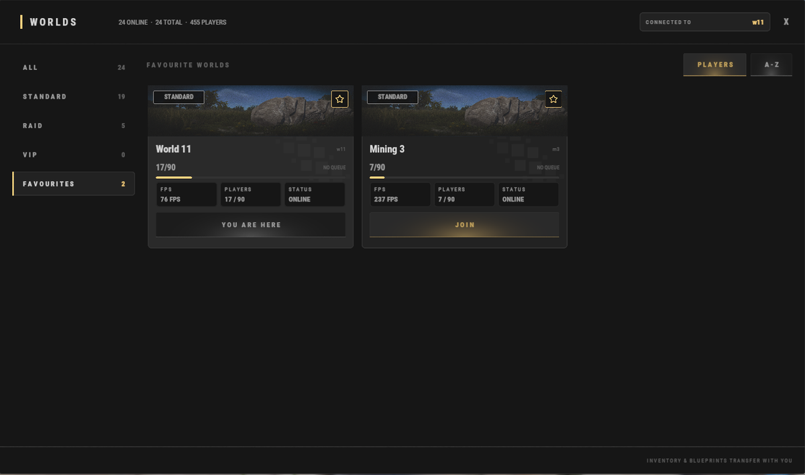

# Beginner Guide

Welcome to **Brits PvE Worlds**! This guide covers everything a new player needs to know to get started and avoid feeling lost during their first few minutes on the server.

> **Fast Overview:**
>
> - **Estimated Time**: 10-20 minutes.
> - **Difficulty:** ⭐☆☆☆☆
> - **Main Goal:** Build your first base, complete the starter quests, and unlock your own Recycler.

---

## First Steps

When you first join the server, you'll either spawn in one of the normal worlds or in the HUB.

All worlds are part of the same server network, and you can switch between them at any time with **`/w`**:

| World | What it's for |
|---|---|
| **HUB** | Central meeting point: player shops, the market, and the portals to the Raid Worlds |
| **World 1-15** | The normal worlds. Pick one to build your base in |
| **Mining World 1-3** | Smaller maps with **no building and no monuments**. Because nothing takes up spawn space, ore nodes and trees spawn far more densely. The recommended place to farm nodes and trees |
| **Raid World 1-5** | Raidable bases, Dungeons and six Bradley islands (**Brad 1-6**) each |

### The HUB

The HUB is the central meeting point of the server.

From here you can:

- Buy from other players' shops (see **[Player Shops](/wiki/player-shops)**).
- Use the main player market with **`/s`**.
- Reach the Raid Worlds through the red portals (or any world with **`/w`**).

You can return to the HUB at any time using **`/hub`**.

---

### Choose Your World

Select the world where you want to build your main base. All worlds use the same map, so your choice won't significantly affect gameplay. Each world holds up to **90 players**.

**Don't forget to favourite the world you picked (the star in the top-right corner of its card) so you can find it again easily under Favourites.**

> 💡 **Your inventory and blueprints transfer with you** when you switch worlds, so you can farm in a Mining World and bring everything back to your base world.

---

### Complete the Starter Quests

Open the quest menu with **`/q`** or **`/quest`** (see the **[Quests](/wiki/quests)** page for every questline) and accept the following quests:

- **Getting Started 1**.
- **Getting Started 2**.
- **Getting Started 3**.

These quests require you to collect:

- 5,000 Stone.
- 5,000 Wood.
- 1,000 Metal Ore.

Completing them rewards you with early building materials, XP, and RP.

---

### Build Your First Base

After finishing the starter quests, you should have enough resources to place a small starter base.

Use **`/sethome <name>`** (or **`/home add <name>`**) to create a teleport point back to your base, and **`/home <name>`** to return to it.

You don't need to worry about doors or locks: only you and your teammates can access anything you place. If you want to give someone else access, use the sharing commands on the **[Commands](/wiki/commands)** page.

---

### Continue Progressing

Once your base is ready, return to the quest menu and accept:

- **Virtual Oil Baron**.
- **Barrel Basher**.

These quests require:

- Collecting **10 Diesel**.
- Destroying **75 Yellow or Blue Barrels**.

After completing them, don't forget to **claim your quest rewards**.

You should now have enough RP to purchase your own **[Recycler](/wiki/recyclers)** from **`/s`**, which will be extremely useful throughout your wipe. Early on, you can use it to recycle unwanted items and unlock valuable blueprints.

You can also use **`/sell`** to exchange valuable items, such as components, for additional RP.

---

## Beginner Tips

> 💡 **Starter Kits**
>
> Use **`/kit`** to claim free starter resources such as medical supplies, wood, stone, and more. Linking or authenticating your account through Discord unlocks additional kits.

> 💡 **Free Equipment**
>
> Looking for your first weapons or explosives? Visit the Raid Worlds by using **`/hub`**, then enter one of the red portals (**Raid World 1-5**). Inside you'll find six Bradley islands (**Brad 1-6**). Experienced players often leave behind unwanted gear that newer players can pick up. 

> 💡 **Useful Commands**
>
> - **`/w`** shows all the available worlds.
> - **`/wa`** opens your stash and achievements.
>
> The full list is on the **[Commands](/wiki/commands)** page.

---

## Continue Reading

Once you've completed these steps, continue with the **[Progression & Levels](/wiki/progression-levels)** guide to learn the fastest ways to level up, unlock skills, and progress through the server.