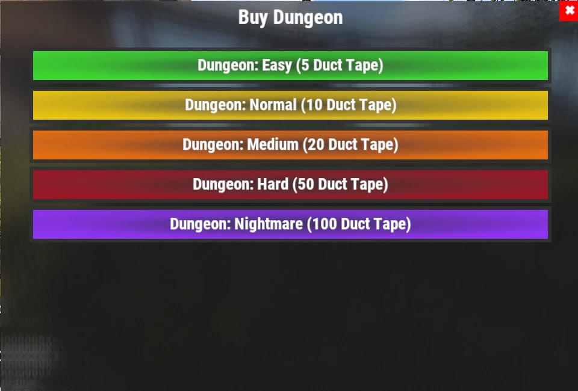

# Dungeon Guide

Dungeons are procedurally generated PvE challenges filled with custom enemies, automated defenses and valuable loot. Each run is different, making them one of the most rewarding repeatable activities on the server.

## Quick Overview

- **Recommended For:** Mid to End Game
- **Difficulty:** ⭐⭐⭐⭐☆
- **Main Goal:** Clear the dungeon, defeat the bosses, and claim the rewards.

---

## Recommended Gear

### Essential

- Plenty of Medical Supplies
- HV Rockets
- Rocket Launcher
- M249 (M2)
  
### Highly Recommended

- **[Ashmaker](/wiki/legendary-weapons)**
- HQM or **[Leviathan Armor](/wiki/legendary-sets)**
- **Extra Rounds** skill (bigger magazines, Combat tree in **[`/st`](/wiki/skills)**)

> 💡 **Tip**
>
> The **Ashmaker** is one of the best weapons for Dungeons. Its HV Rockets allow you to quickly eliminate groups of enemies and destroy turrets from a safe distance.

---

## Starting a Dungeon

1. Use **`/worlds`**.
2. Enter one of the **Raid Worlds (1-5)**.
3. Enter the **Dungeon** portal.
4. Use **`/buydungeon`**.
5. Choose a difficulty and pay for it in **Duct Tape** (prices below).
6. Once it spawns, interact with the entrance door (**E**) to enter.

### Dungeon Prices

| Difficulty | Price |
|---|---:|
| **Easy** | 5 Duct Tape |
| **Normal** | 10 Duct Tape |
| **Medium** | 20 Duct Tape |
| **Hard** | 50 Duct Tape |
| **Nightmare** | 100 Duct Tape |

Loot improves with difficulty (see **[Item Drops](/loot-tables)**).

> ⚠ **Attention**
>
> In case you die while doing your dungeon run, do not worry, your body will be teleported outside of the dungeon door.
>
> You can then loot it up and go back in as normal.

---

## How Dungeons Work

Every dungeon is **randomly generated**, so no two runs are exactly the same.

Inside you'll encounter:

- Custom NPCs with firearms.
- Automated Turrets.
- Multiple combat rooms separated by Garage Doors.
- Valuable loot throughout the Dungeon.

Each garage door leads to a new section. Clear every room before opening the next one.

---

## Combat Strategy

The safest approach is to progress slowly.

1. Open one Garage Door.
2. Eliminate every enemy inside the room.
3. Destroy any Turrets before advancing.
4. Loot the room.
5. Continue to the next section.

> 💡 **Tip**
>
> Loot as you progress through the Dungeon instead of waiting until the end.

---

## Loot Phase

Once every room has been cleared, the Dungeon enters its final loot phase.

You have approximately **5 minutes** before the Dungeon closes and kicks you out.

> ⚠ **Important**
>
> Five minutes usually isn't enough to collect every item.
>
> For the best results, loot each room immediately after clearing it rather than saving everything for the end.

---

## Cooldowns

After finishing a Dungeon, interact with the entrance door again to leave.

Just like **[Raids](/wiki/tackling-raiding)** and **[Bradleys](/wiki/tackling-bradleys)**, Dungeon cooldowns are tracked separately for each Raid World.

> 💡 **Tip**
>
> Switch between **Raid Worlds 1-5** to continue running Dungeons without waiting for your cooldowns.

---

## Continue Reading

Need help choosing the best gear for your next Dungeon?

Continue with **[Legendary Weapons](/wiki/legendary-weapons)** and **[Legendary Sets](/wiki/legendary-sets)** to discover the equipment best suited for difficult PvE encounters, or see the **[Quests](/wiki/quests)** page for the Dungeon Crawler questline.