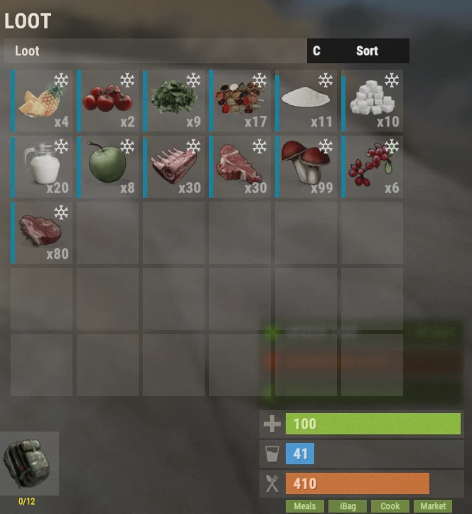

# Food System

The Food System introduces dozens of custom meals and ingredients that provide powerful bonuses for gathering, combat, farming, fishing, crafting, and many other activities. Choosing the right meal can greatly increase your efficiency and is an important part of progression on Brits PvE Worlds.

## Quick Overview

- **Recommended For:** All Players
- **Main Goal:** Use meals to gain temporary bonuses for different activities.
- **Important:** Meals spoil over time unless stored in a refrigerator or your **iBag**.

> 💡 **Tip**
>
> Food bonuses stack with many bonuses from the **[Skill Tree](/wiki/skills)**, making meals an important part of progression.

---

## Food System Basics

When opening your inventory, you'll notice four green buttons in the bottom-right corner:

| Button | What it does | Command |
|---|---|---|
| **Meals** | Shows your active food buffs | (no command) |
| **iBag** | Your ingredients bag (also works as a fridge) | `/ibag` |
| **Cook** | The cooking menu, where you craft meals | `/cook` |
| **Market** | The Farmers Market, where players buy and sell ingredients | `/fmarket` |

Each is explained below.

### Meals

The **Meals** menu displays all active food buffs currently affecting your character.

This button only becomes available while you are carrying at least one cooked meal.

### iBag

The **iBag** automatically stores food ingredients such as milk, vegetables, meat, and other cooking materials.

Benefits include:

- Automatically stores ingredients you collect.
- Functions as a refrigerator.
- Prevents ingredients from spoiling.

### Cook

The **Cook** menu is where you create custom meals. It contains four sections:

**Recipes** displays every meal you can craft. Selecting a meal shows:

- Required ingredients
- Crafting cost
- Meal effects
- Buff duration

**Ingredients** shows every ingredient available on the server and explains where it can be obtained.

**Favourites** lists the meals you've starred for quick access. Click the ⭐ inside a recipe to favourite it.

**Settings** contains various cooking-related options. All settings are enabled by default.

### Market

The **Farmers Market** allows players to buy and sell cooking ingredients, for example:

- Bread
- Sugar
- Cloth
- Other cooking materials

Buying costs **Scrap**, and selling ingredients rewards you with **Scrap**.

> 💡 **Important**
>
> The Farmers Market only has stock if other players have sold items to it.

---

## Which Meal for Which Activity

Quick reference for the most common activities on the server.

| Activity | Recommended Meal |
|-----------|------------------|
| Quartermaster (Stone, Metal, Sulfur) / Mining | Bangers and Mash |
| Quartermaster (Wood) / Wood Farming | Grilled Pork Kebab |
| Crafting | Pork Omelette |
| Farming (player-grown crops) | Mushroom Soup |
| Animal Farming / Bone Fragments | Succulent Chicken Sandwich |
| Bradley | Chocolate Calzone |
| Patrol Helis | Steak Dinner |
| Harbinger | French Toast |
| Deep Sea | Pumpkin Pie |
| Fishing | Baked Trout |
| Raiding | Pancakes |
| Healing | Pumpkin Pie |
| Radiation | Chernobyl Casserole |
| Group Bosses | Berry Cobbler |

> 💡 **Tip**
>
> The **Skilled Chef** skill (Survivalcraft tree, Farming section) doubles cooking speed and **meal buff duration**, so your buffs last twice as long.

---

## Recommended Meals

These are the meals you'll use most often throughout your progression.

<strong>⏬ Show the recommended meals ⏫</strong>

### Gathering & Progression

Best meal for Quartermaster Stone, Metal and Sulfur quests.

---

Best meal for Quartermaster Wood quests.

---

Best meal for Crafting quests.

---

Best meal for harvesting player-grown crops.

---

Best meal for farming animals and Bone Fragments.

---

Best meal when tackling Bradleys.

---

## Useful Meals

These meals aren't used as frequently but are extremely valuable in certain situations.

<strong>🔽 Show the useful meals 🔼</strong>

Best meal for Fishing.

---

Excellent for Patrol Helis and difficult PvE encounters.

---

Provides exceptional healing.

---

Only meal that provides Radiation protection.

---

Great preparation meal before tackling difficult content.

---

Excellent for Raiding.

---

Great preparation meal before Harbinger or Patrol Helis.

---

Excellent support meal for group activities thanks to its healing effects.

---

## Ingredients

Every meal requires ingredients gathered throughout the server.

You can discover where each ingredient comes from through the **Ingredients** section inside the Cooking menu.

<strong>🔽 Show all ingredients 🔼</strong>

---

---

---

---

---

---

---

---

---

---

---

---

---

---

---

---

---

---

---

---

---

---

---

---

---

---

---

## Other Meals

The meals below have more niche uses and are generally crafted less frequently, but each still has its own purpose.

<strong>⤵️ Show all other meals ⤴️</strong>

---

---

---

---

---

---

---

---

---

---

---

---

---

---

---

---

---

---

---

---

---

---

---

---

---

---

---

---

---

---

---

---

---

---

---

---

## Continue Reading

Meals become even stronger when combined with the **Skill Tree**.

Continue with the **[Skills](/wiki/skills)** page to learn which perks synergize best with cooking and food buffs.
