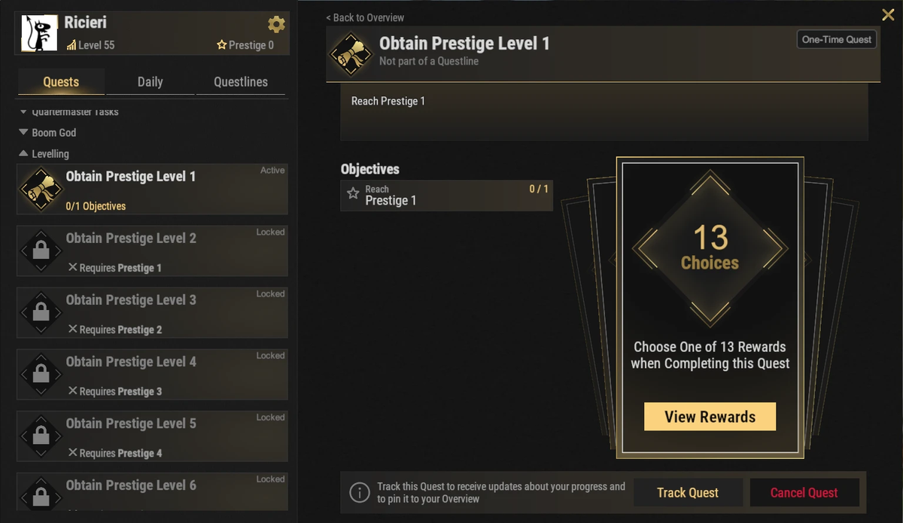
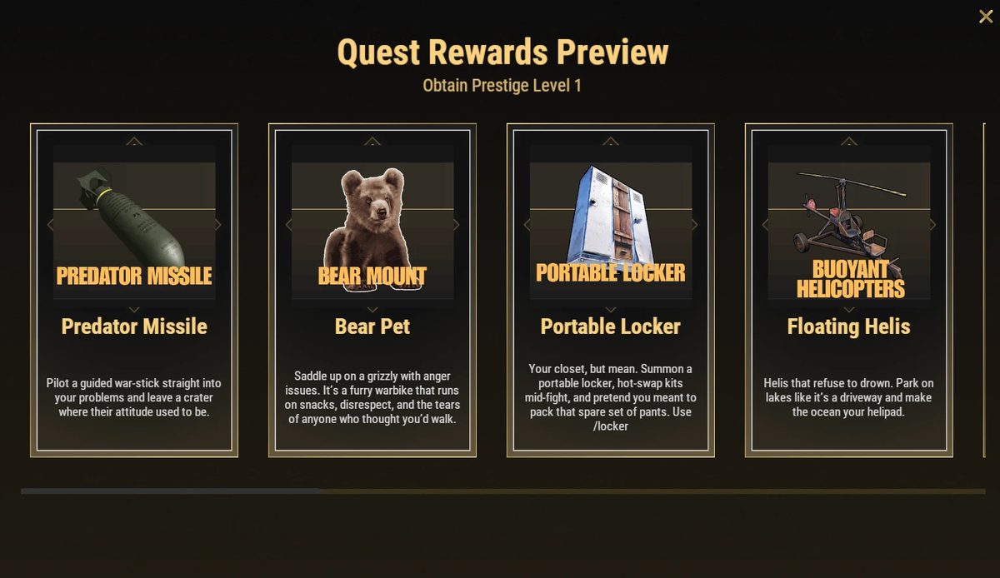

# Prestige Perks

Prestige perks are special unlocks that provide powerful quality-of-life improvements, progression boosts, automation features, and unique gameplay mechanics. While none of them are required, many can significantly improve your experience on Brits PvE Worlds.

## Quick Overview

- **Recommended For:** Mid to End Game
- **Main Goal:** Choose perks that best match your preferred playstyle

> 💡 **Recommended Perks**
>
> - 5 Starting SP
> - Nightvision
> - 20% XP Boost

---

## How Prestige Perks Work

- You can Prestige once your overall level reaches **90** (see **[Progression & Levels](/wiki/progression-levels)**). There are **10 Prestige levels**.
- Every Prestige level has a quest in the **Levelling** questline in **`/q`**. Completing it lets you **pick one perk** from the list below.
- There are **13 perks** but only 10 Prestige levels, so you cannot unlock all of them. Choose the ones that fit your playstyle.
- Prestige perks are kept for the whole XP cycle; they are not lost on map wipes.

---

## Progression Perks

These perks help you level up faster and progress through the server more efficiently.

### Five Starting Skill Points

Start every prestige with **5 additional Skill Points**, allowing you to unlock useful skills much earlier.

---

### 20% XP Boost

Increases all XP gained by **20%**, making levelling and progressing significantly faster.

---

## Utility Perks

These perks improve convenience and reduce downtime.

### Portable Recycler

Summon a personal Recycler wherever you need it with **`/rec`**.

Perfect for monument runs, farming trips, and long sessions away from base.

---

### Portable Locker

Summon a portable locker anywhere with **`/locker`** to hot-swap kits mid-fight.

Very useful during raids and PvE events.

---

### 5 Second Teleport

Reduces the teleport countdown from **20 seconds** to **5 seconds**.

Excellent for players who travel frequently between bases and events.

> ⚠ The in-game description warns: **do not pick this if your teleport countdown is already 0** (some ranks already have no countdown).

---

## Automation Perks

### Auto Sell to Server

Unlocks the Item Bank and the Auto Sell system, allowing resources stored in your Item Bank to be sold automatically. You can store up to **4 different server-sell items per world**, with up to **6 stacks of each**.

See the **[Item Bank & Auto-Sell](/wiki/auto-sell)** page for a complete setup guide.

---

### Terminal

Unlocks the Terminal system, allowing advanced storage equipment and industrial automation.

See the **[Terminal](/wiki/terminal)** page for more information.

---

## Combat & Mobility

### Predator Missile

Pilot a guided missile for devastating attacks.

---

### Double Jump

Gain the ability to perform a second jump while airborne.

Useful for movement, exploration, and reaching otherwise inaccessible locations.

---

### Nightvision

Sets your personal time to **12:00**, so you see daylight even at midnight, with no green tint. Toggle it with **`/nv`**.

Especially useful for farming and nighttime PvE activities.

---

### Pilot Assistance

Adds several helicopter assistance features, including:

- Auto-hover
- Auto-land
- Flight assistance
- Crash prevention

One of the best perks for players who fly frequently.

---

### Floating Helis

Allows helicopters to land and remain floating on water.

Perfect for **[Deep Sea](/wiki/deep-sea)** exploration and ocean monuments.

---

## Companion Perks

### Bear Pet

Unlocks a companion bear (shown in game as **Bear Mount**) that can:

- Gather resources
- Be ridden
- Carry items in its own inventory

Excellent for farming and long resource runs.

---

## Continue Reading

Many of these perks unlock entirely new mechanics.

Continue with the **[Terminal](/wiki/terminal)** and **[Item Bank & Auto-Sell](/wiki/auto-sell)** guides to learn how to make the most of these two perks.
