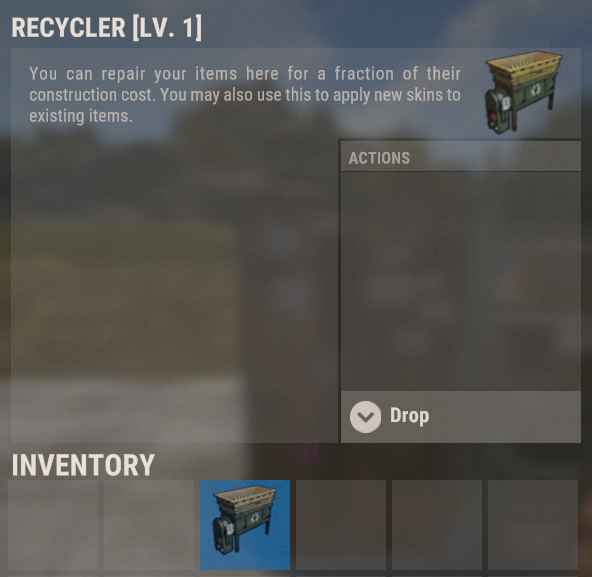
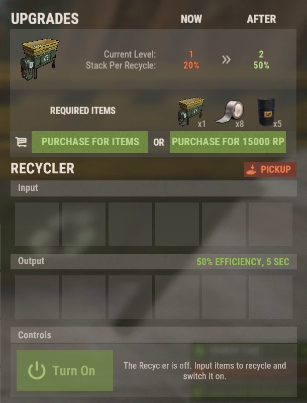

# Recyclers

Recyclers on Brits PvE Worlds are **placeable items** with their own upgrade levels, so you don't have to run to a monument every time you want to recycle.

## Quick Overview

- **Recommended For:** All Players
- **Main Goal:** Recycle unwanted loot at home, faster and with bigger stacks as you upgrade.

> 💡 **Tip**
>
> Buying your own Recycler is the goal of the starter quests on the **[Beginner Guide](/wiki/beginner-guide)**. Early on it turns unwanted loot into scrap for blueprints; later it feeds the RP methods on **[Best RP Methods](/wiki/best-rp-methods)**.

---

## Getting a Recycler

- Buy one with RP from **`/s`**.
- They also drop as loot in some places.

The Recycler is an inventory item: place it like any deployable. The item description in game is the vanilla repair bench text, so ignore that; it recycles.

> ⚠ **Do not recycle at Outpost or Bandit Camp** if you're doing the Tactical Gloves method (see **[Best RP Methods](/wiki/best-rp-methods)**). Use a monument recycler or your own.

---

## Using It

Open the placed Recycler:

- Put items in the **Input** slots.
- Press **Turn On**. Recycled materials appear in the **Output** slots.
- **Pickup** takes the Recycler back into your inventory.

A Level 1 Recycler runs at **50% efficiency** with a **5 second** cycle, and processes **20% of a stack per cycle**.

> 💡 **Skill Tree**
>
> The **Rapid Recycle** skill (Gathercraft tree, Gathering & Fishing section, 1 SP) cuts the cycle time by 2.5 seconds. See **[Skills](/wiki/skills)**.

---

## Upgrading

Recyclers have levels. Each level increases the **stack per recycle**, meaning how much of a stack is processed each cycle. The upgrade panel is at the top of the Recycler's UI and can be paid **with items or with RP**.

| Level | Stack per recycle | Upgrade cost to reach this level |
|---|---:|---|
| 1 | 20% | Starting level |
| 2 | 50% | 1 Recycler + 8 Duct Tape + 5 barrels (see screenshot), **or 15,000 RP** |
| 3+ | ? | ? |

Costs and values for the higher levels are not documented yet. If you have a Level 2 or higher Recycler, screenshot the upgrade panel and add it here (see **[Contribute](/contribute/contribute)**).

---

## Continue Reading

Continue with **[Best RP Methods](/wiki/best-rp-methods)** to see how a Recycler turns Tactical Gloves into cloth and RP, or **[Virtual Quarries](/wiki/virtual-quarry)** for the other big passive-resource system.
