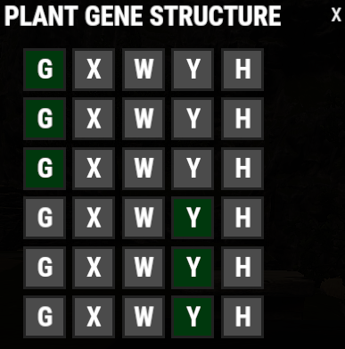

# /setgenes Guide

The **`/setgenes`** command allows you to choose the exact gene combination for a seed, making farming much faster and more consistent.

## Quick Overview

- **Recommended For:** Players using the Harvesting Skill Tree.
- **Main Goal:** Apply the exact gene combination you want without relying on random genetics.

> 💡 **Tip**
>
> This command is especially useful when setting up large farms for the **Best RP Methods** covered elsewhere in the wiki.

---

## Video Guide

@[youtube](https://www.youtube.com/watch?v=LkRuThloZjs){width=960 height=540}

---

## Before You Start

Before using **`/setgenes`**, make sure you have:

- A normal seed in your hotbar.
- An available **`/setgenes`** cooldown.

You can check your cooldown at any time using:

**`/cd`**

> ⚠ **Important**
>
> If the steps below are not followed in the correct order, the command may go on cooldown without applying your selected genes.

---

## Step-by-Step Guide

1. Place a **normal seed** in your hotbar.
2. Type **`/stfix`**.
3. Type **`/setgenes`**.
4. Select the desired gene combination from the menu.

5. Close the menu using the **X** in the top-right corner.
6. Plant **one seed** in a planter box.
7. Your planted seed should now have the selected gene combination.

---

## Troubleshooting

If the command doesn't work:

- Make sure you have a normal seed in your hotbar.
- Run **`/stfix`** before using **`/setgenes`**.
- Verify that you selected the correct gene combination.
- Close the menu before planting the seed.
- Check **`/cd`** to make sure the command isn't on cooldown.

---

## Continue Reading

Interested in making the most of your crops?

Continue with **Best RP Methods** to learn how to use perfect genes for large-scale farming and passive RP generation.