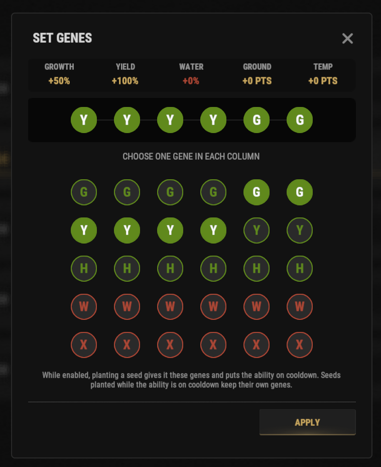

# Geneticist Guide

The geneticist skill allows you to choose the exact gene combination for a seed, making farming much faster and more consistent.

## Quick Overview

- **Recommended For:** Players who have unlocked the **Geneticist** skill (Survivalcraft tree, Farming section, 5 SP).
- **Main Goal:** Apply the exact gene combination you want without relying on random genetics.

> 💡 **Tip**
>
> This skill is especially useful when setting up large farms for the **[Best RP Methods](/wiki/best-rp-methods)** covered elsewhere in the wiki.

---

## Video Guide

@[youtube](https://www.youtube.com/watch?v=E7c142tDCtQ){width=960 height=540}

---

## Before You Start

Before using the skill, make sure you have:

- A normal seed in your hotbar.
- The Geneticist skill off cooldown (it has a **3 hour** cooldown).

> ⚠ **Important**
>
> If the steps below are not followed in the correct order, the skill may go on cooldown without applying your selected genes.

---

## Step-by-Step Guide

1. Place a **normal seed** in your hotbar.
2. Open the Skill Tree with **`/st`**.
3. Click on the top right lighting icon.
4. Search for the **geneticist ultimate** and click on **activate**.
5. Select the desired gene combination from the menu.

6. Close the menu using the **X** in the top-right corner.
7. Plant **one seed** in a planter box. *note: **DO NOT SHIFT CLICK YOUR SEEDS***
8. Your planted seed should now have the selected gene combination.

---

## Troubleshooting

If it doesn't work:

- Make sure you have a normal seed in your hotbar.
- Verify that you selected the correct gene combination.
- Close the menu before planting the seed.

---

## Continue Reading

Interested in making the most of your crops?

Continue with **[Best RP Methods](/wiki/best-rp-methods)** to learn how to use perfect genes for large-scale farming and RP generation.
