# Skills

## Overview
## Skill Tree
By using the command /st or clicking on the XP bar, when you are in your inventory, the skill tree overlay will open. 
By clicking on "OVERVIEW" you see a description of all buttons & informations of the skill tree overlay.

  
⏬<h3>OVERVIEW</h3>⏫

  
### In the top bar:
  - You will see the different skill tree sections, you will always start in the mining skill tree if you open the overlay.

---
### On the left side:
  - You will see on top the skill description of the effect you will recive for each level.
  - Below you will see the following informations from top to buttom;
  - **Maximum Level**
    - Shows you the maximum level you can gain of this skill.
  - **Level Up Button**
    - With this button you level the selected skill.
  - **Respec Cost**
    - Shows you the amount of scrap you need to set all skills of the selected section to zero, each time you use this option the scrap cost will increase.
  - **Respec Button**
    - Set every skill of the selected section to zero.
  - **Rested XP Pool**
    - Shows you the amount of XP that will be added extra by doing certain things like mining.
    - As long as you have rested XP, you will see a blue XP number, when you for example mine stone.
  - **Current Level:**
    - Shows you your current level.
  - **XP**
    - Shows you your overall earned XP. The left number has the added rested XP pool and the right number is your current amount of XP.
  - **Available Points**
    - Displays the amount of unused skill points you have left.
  - **Prestige Level**
    - If you gained prestige, the prestige level will be displayed here.
  - **Gain Prestige Button**
    - If you reached LVL 100, you can choose to gain prestige with this button.
    - If you click on the button, the benefits of the perstige will be displayed. In that overlay you will finaly choose to gain prestige or cancel it.
    - If you gain prestige, be aware that your level will trop to zero and your skill points too.
    - **TIP**: If you want to prestige, finish Quartermaster T4-5 quests but don't redeem them. You can redeem quest after you gained prestige and will quickly level up again.
  - **Ultimate Settings**
    - Displays different options you can toggle on or off. For example here you can move your XP bar to another place.
  - **Buff Settings**
    - Displays different options you can toggle on or off.
---
### In the middle of the overlay you will find:
  - The selected skill tree name.
  - How many skill points you've spended at this skill tree.
  - How many skill points overall you've spended out of 999.
  - The different skills that are availalbe in this skill tree.
      - The first row of skills are unlocked by default, each other row will be unlocked after using at least 5 skill points. 
      - If a skill tree has a ultimate skill, you will need at least 25 skill points to unlock the ultimate.
---
### On the right side:
  - Buff Information
      - Here you will see the different skill buff informations. For example how much mining yield plus % you get from your skills.

## Beginner Skills Guide
Take a look around all the differnt skills and decide what skills are suitable for your playstyle. 
But there are is one nesessary skill to learn; 

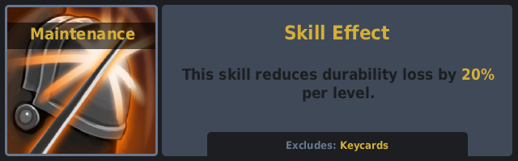

*You will find this skill in the combat skill tree*
- This skill will prevent all damage to weapons, tools etc. if you level it up to level 5.
---

## Recommended Early Skills
The most recommended skills are those that help you level up faster so following the prior tab, we will be focussing on the Quartermaster tasks once again so, prioritize unlocking:

### Mining section
All skills under this tree are important, but the following skills of this section can be skipped or used later.

  
🔽 <h3>SKILLS TO SKIP</h3> 🔼

  
  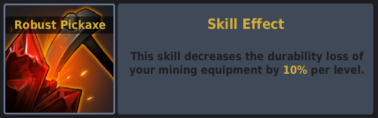
  - No need for this skill if you just skill maintenance up.
  ---

  
  - It's a nice to have, but you don't need it. Also refined materials don't count toward the quartermaster tasks.
  ---

  
  - Can be unlocked later, not need in the early game for this ultimate.

---
### Woodcutting Section
In this section almost all skills are important,the only once you should skip for the early game are:
  - Each skill that isn't listed is ether not necassery or can be unlocked at a later stage.

  
🔽 <h3>SKILLS TO SKIP</h3> 🔼

  
  
  - Charcole isn't importatend at this stage.
  ---

  
  - No need for this skill if you just skill maintenance up.
  ---

- TIP: Try to unlock the ultimate in this section as soon as possible, this will greatly improve your wood yield.
---

## Mid-Game Skills
### Tackling Raids, Bradleys & Helis
Once you start tackling Raids, Bradleys, and Helis, focus on the following skills of the raiding section:

 
  
🔽 <h3>MID GAME SKILLS</h3> 🔼

  
  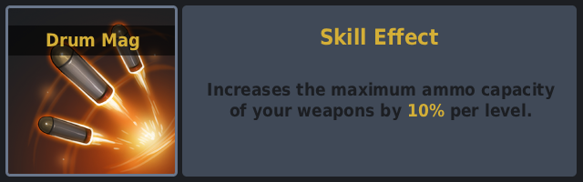
  - Fully unlocked, it increases magazine capacity by 50%.
  ---
  **Raiding Section:**
  
  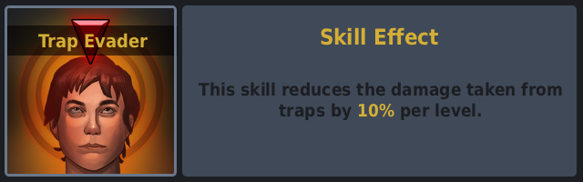
  - To unlock the second row.
  ---

  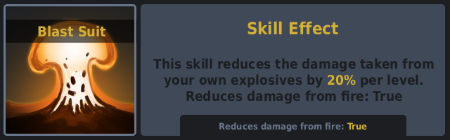
  - Prevents you from your own rockets and explosives.
  ---

  
  - Your satchels will explode.
  ---

  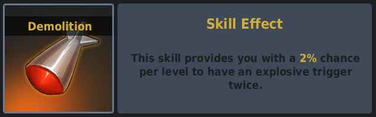
  - Makes raiding quicker.
  ---

  
  - Makes raiding quicker.
  ---

  
  - Destroys easy and medium bases with ease. Always good to start a raid with it. Be aware of SAM sites, the will shoot down your MLRS Strike, so destroy them first (if they are smoking, they are destroyed).
  ---

**TIP:** If you want to tackle raids its best if you get yourself a Brits Boom Stick, its a revolver that shoots rockets, if you want to focus on bradleys then get yourself an Ashmaker its a revolver that shoots HVs and lastly, if you want to do helicopters then get yourself an M2. You can find all legendary weapons [here](legendary-weapons.md).

---
### Gaining Scrap/RP
If you are starting to do your first harvest of hemp or other plants, keep in mind, that not only [legendary sets](legendary-sets.md) are necassery for a good harvest. There are also must have skills for this tasks. Here are the most important skills to unlock in the harvesting section:

  
🔽 <h3>HARVESTING SKILLS</h3>🔼 

  
  
  - Got skill and opends up the second row and gives you more yield of wild collectibles.
  ---

  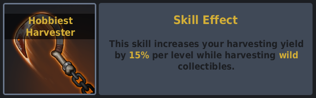
  - Gives you more yield of wild collectibles. 
  ---

  
  - Gets you more yield out of your grown plants.
  ---

  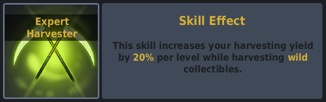
  - Gives you now the maximum yield for wild collectibles.
  ---

  
  - Now you have the maximum yield for your grown plants.
  ---

  
  - This is one of the best ultimates, because it lets you choose the gene yourself.
  - Be aware only the next seed you are planting will have the set genes.
  ---

  - The rest of the skills in this skill tree are not really important. But if they fit your playstyle use them as you see fit.

## Late-Game
There isn’t much to say about late game, if you are here it means you already know your preferred playstyle so i am sure you will already have unlocked the skills you are more interested in, what i can suggest is to unlock the Crafting Tree as it helps you with the more demanding quests like Boom for the Boom God.

## List of all Skills
Here you will find all the skills that are available on the server, sorted in sections.

  
⬇️<h3>MINING</h3>⬆️

  
  
  ---
  
  
  ---
  
  
  ---
  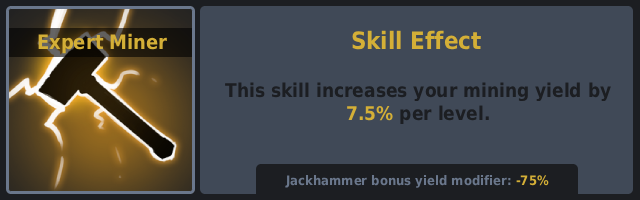
  
  ---
  
  
  ---
  
  
  ---
  
  
  ---
  
  
  ---
  
  
  ---
  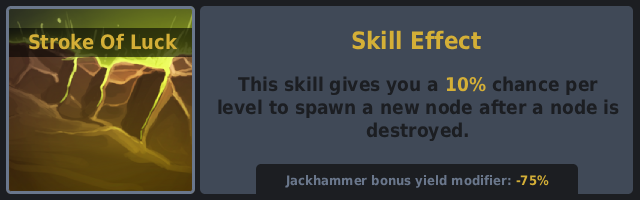

---

  
⬇️<h3>WOODCUTTING</h3>⬆️

  

  ---
  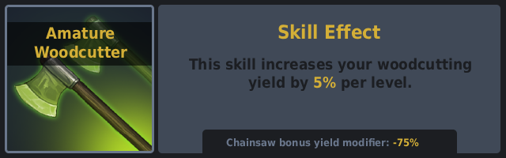

  ---
  

  ---
  

  ---
  

  ---
  

  ---
  

  ---
  

  ---
  

---

  
⬇️<h3>SKINNING</h3>⬆️

  

  ---
  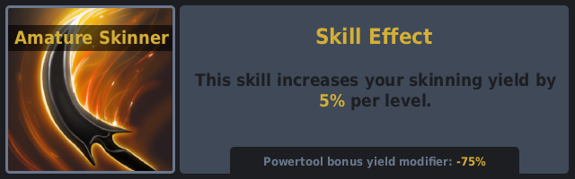

  ---
  

  ---
  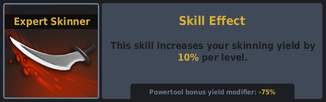

  ---
  

  ---
  

  ---
  

  ---
  

  ---
  

  ---
  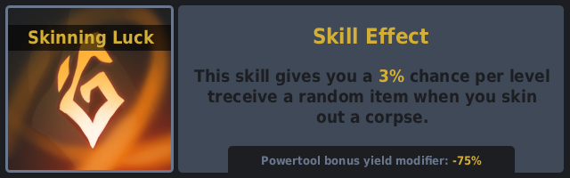

  ---
  

---

  
⬇️<h3>HARVESTING</h3>⬆️

  

  ---
  

  ---
  

  ---
  

  ---
  

  ---
  
  
  ---
  

  ---
  

  ---
  

  ---
  

  ---
  

  ---
  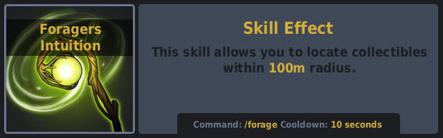

---

  
⬇️<h3>MEDICAL</h3>⬆️

  

  ---
  

  ---
  

  ---
  

  ---
  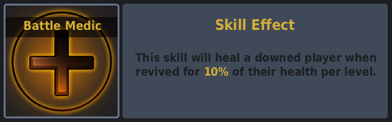

  ---
  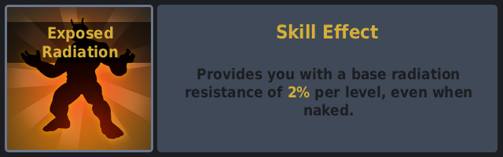

  ---
  

  ---
  

  ---
  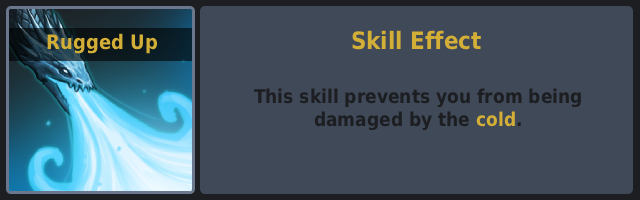

  ---
  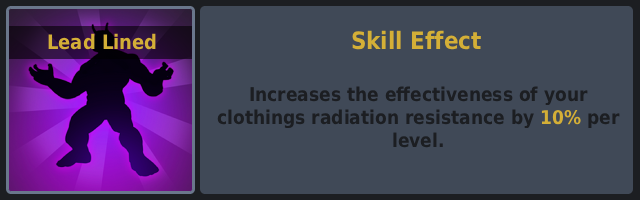

  ---
  

  ---
  

  ---
  

---

  
⬇️<h3>COMBAT</h3>⬆️

  

  ---
  

  ---
  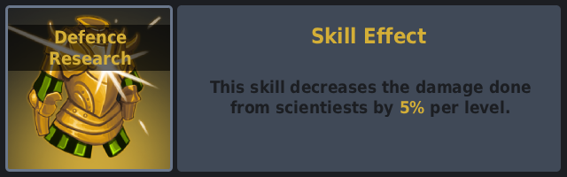

  ---
  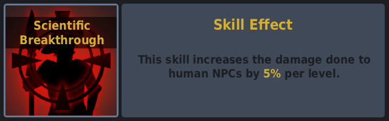

  ---
  

  ---
  

  ---
  

  ---
  

  ---
  

  ---
  

  ---
  

---

  
⬇️<h3>BUILD CRAFT</h3>⬆️

  
  

  ---
  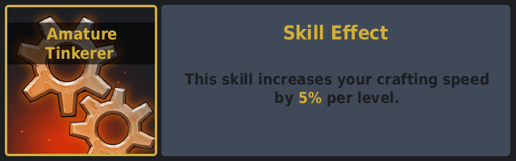

  ---
  

  ---
  

  ---
  

  ---
  

  ---
  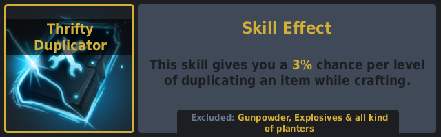

  ---
  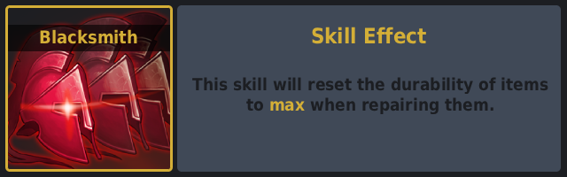

  ---
  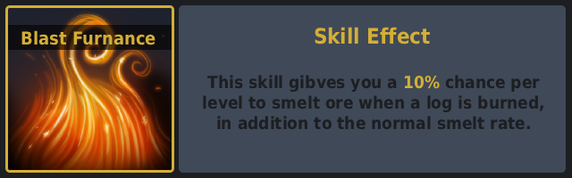
  
  ---
  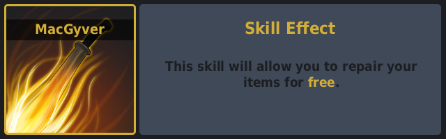

  ---
  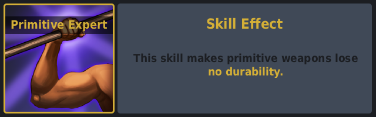

  ---
  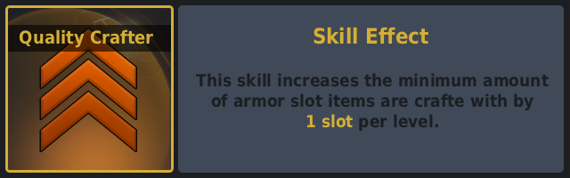

  ---
  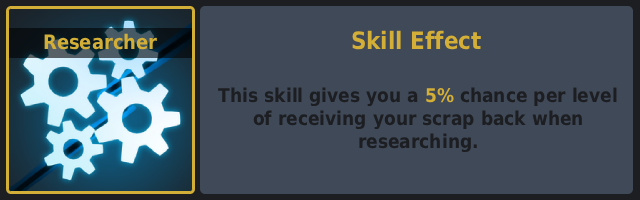

---

  
⬇️<h3>SCAVENGING</h3>⬆️

  

  ---
  

  ---
  

  ---
  

  ---
  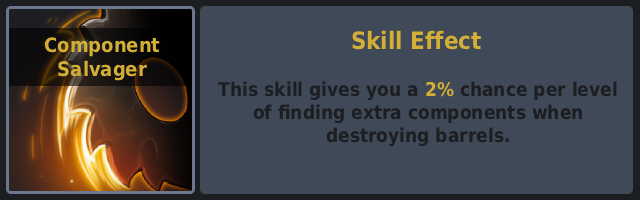

  ---
  

  ---
  

  ---
  

  ---
  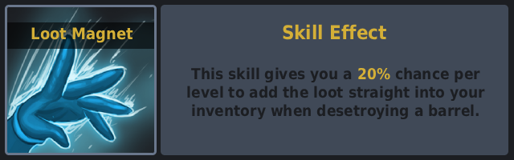

  ---
  

  ---
  

  ---
  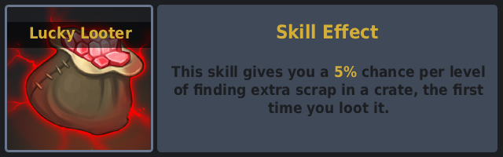
  
  ---
  
  
  ---
  

  
⬇️<h3>VEHICLES</h3>⬆️

  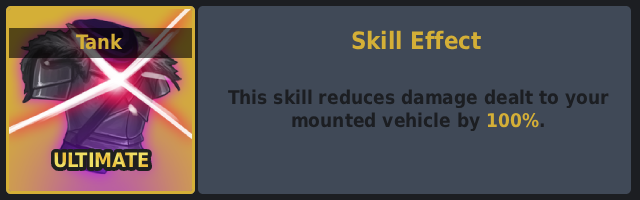

  ---
  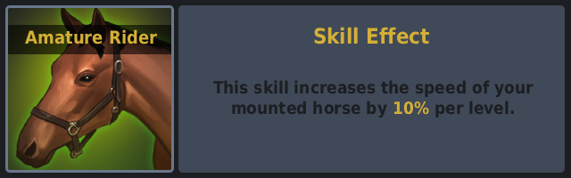

  ---
  

  ---
  

  ---
  

  ---
  

  ---
  

  ---
  

  ---
  

  ---
  

  ---
  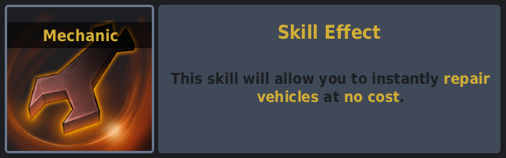

  ---
  

---

  
⬇️<h3>COOKING</h3>⬆️

  

  ---
  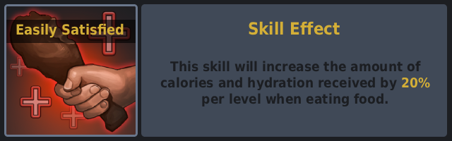

  ---
  

  ---
  

  ---
  

  ---
  

  ---
  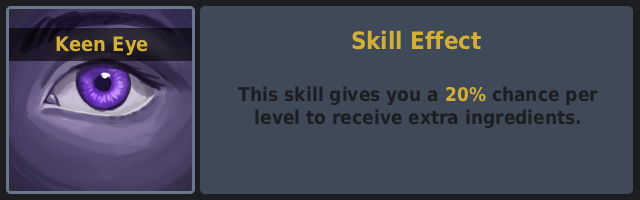

  ---
  

  ---
  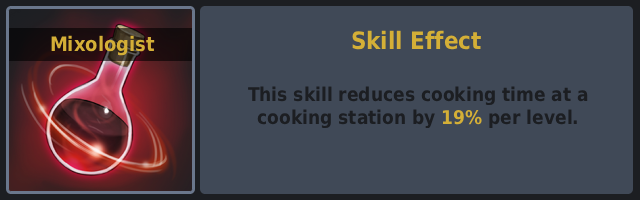

  ---
  

  ---
  

  ---
  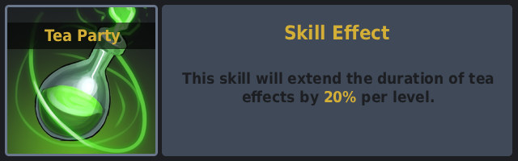

---

  
⬇️<h3>UNDERWATER</h3>⬆️

  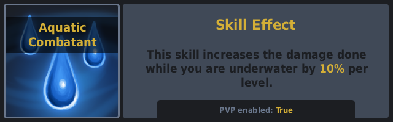

  ---
  

  ---
  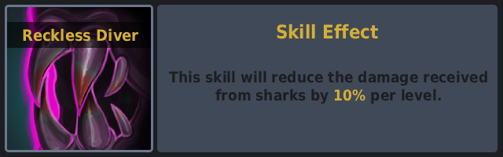

  ---
  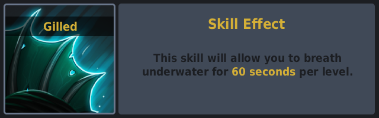

  ---
  

  ---
  

  ---
  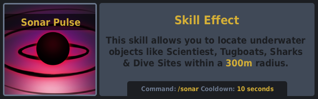

  ---
  

---

  
⬇️<h3>RAIDING</h3>⬆️

  

  ---
  

  ---
  

  ---
  

  ---
  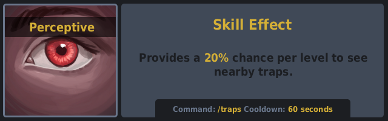

  ---
  

  ---
  

  ---
  

---

  
⬇️<h3>TEAM</h3>⬆️

  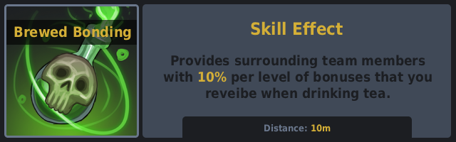

  ---
  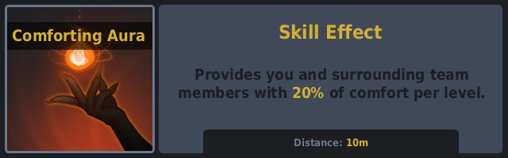

  ---
  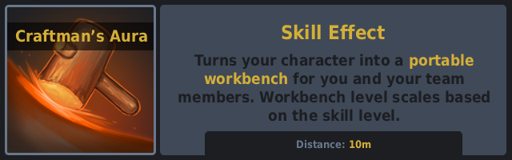

  ---
  

  ---
  

  ---
  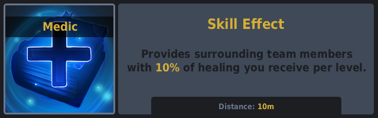

