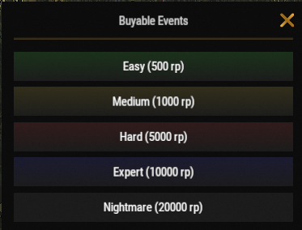

# Tackling Raiding

Raiding is one of the most rewarding activities on Brits PvE Worlds. By purchasing pre-built raid bases, you can earn valuable loot and large amounts of RP while testing your raiding skills.

## Quick Overview

- **Recommended For:** Mid to End Game
- **Difficulty:** ⭐⭐⭐☆☆
- **Main Goal:** Complete raid bases efficiently while maximizing your profit.

---

## Recommended Gear

### Essential

- Plenty of Rockets or C4
- The **Explosives** skills from the Combat tree (**[`/st`](/wiki/skills)**)

### Highly Recommended

- **[Brits Boom Stick](/wiki/legendary-weapons)**
- **[Ashmaker](/wiki/legendary-weapons)**

> 💡 **Tip**
>
> Legendary launchers greatly reduce the time needed to complete harder raid bases and make clearing them much safer.

---

## Starting a Raid

1. Use **`/worlds`**.
2. Enter one of the **Raid Worlds (1-5)**.
3. Use **`/buyraid`**, choose a difficulty and purchase the raid base with RP.

---

## Raid Difficulties

Raid bases are bought with RP from the **Buyable Events** menu (`/buyraid`). Combat XP per completed raid is from the **[Progression & Levels](/wiki/progression-levels)** page.

| Difficulty | Price | Base Material | Combat XP | Recommended For |
|------------|------:|---------------|----------:|-----------------|
| **Easy** | 500 RP | Wood | 1,000 | New Players |
| **Medium** | 1,000 RP | Metal | 2,500 | Mid Game |
| **Hard** | 5,000 RP | HQM | 5,000 | Experienced Players |
| **Expert** | 10,000 RP | HQM | 7,000 | End Game |
| **Nightmare** | 20,000 RP | HQM | 12,000 | End Game |

Higher difficulties require significantly more explosives but offer much better rewards.

---

## Combat Strategy

Before attempting harder raid bases, make sure you've unlocked the **Explosives** section of the Combat tree through **`/st`** (Shockwave, Chain Reaction, Reliable Fuses, Aerodynamically Sound, Blastproof and Orbital Strike).

While clearing a raid:

- Move slowly and check every room.
- Watch out for hidden traps.
- Bring enough explosives to finish before the raid timer expires.
- If you die, recovering your gear can be difficult due to trap placement.

> ⚠ **Important**
>
> Raid bases are timed. If you don't finish them before the timer expires, the base will despawn.

---

## Orbital Strike

If you're using the **Orbital Strike** skill from the Combat tree (it spawns a flare in your hotbar; throw it where you want the strike):

> ⚠ **Important**
>
> Always destroy the **SAM Sites** before throwing the flare.
>
> Once smoke starts coming from the SAM Sites, they're disabled and your strike can safely hit the base.

---

## Profit Potential

Raiding is currently one of the best RP-making activities on the server.

A **Nightmare Raid** costs **20,000 RP** to purchase but can reward **around 100,000 RP** upon completion, making it one of the highest-profit PvE activities available. The Raiding questline on the **[Quests](/wiki/quests)** page pays out on top of that.

---

## Cooldowns

Raid cooldowns are tracked separately for each Raid World.

> 💡 **Tip**
>
> Just like **[Bradley Islands](/wiki/tackling-bradleys)**, you can switch between **Raid Worlds 1-5** to continue raiding without waiting for your cooldown to expire.

---

## Continue Reading

Looking for assistance or need to report a bug during a raid?

Continue with **[Support Tickets](/wiki/support-tickets)** to learn when and how to contact the staff.