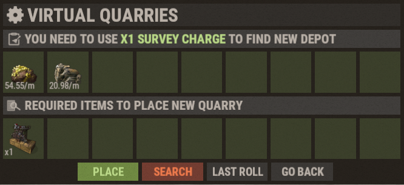

# Virtual Quarries

Virtual Quarries are one of the best passive resource systems on Brits PvE Worlds, allowing you to generate resources while you're offline or away from your base.

## Quick Overview

- **Recommended For:** Early to End Game
- **Main Goal:** Generate passive resources with minimal maintenance.

| Quarry | Produces | Best For |
|--------|----------|----------|
| Mining Quarry | HQM, Metal Ore, Sulfur Ore | Resource Farming |
| Pump Jack | Crude Oil | Fuel Production |
| Wood Generator | Wood | Building & Smelting |

---

## Getting Started

1. Open the Shop using **`/s`**.
2. Purchase **Survey Charges**.
3. Buy the Virtual Quarry you want.
4. Open the Virtual Quarry menu with **`/vq`** (or **`/qr`**).
5. Survey for a depot until you get a good roll (see below).
6. Place your Quarry.
7. Keep it supplied with **Diesel Fuel**.

### Surveying for a Depot

Every quarry sits on a **depot**, and each depot is found by spending **one Survey Charge**. A roll shows which resources the depot contains and their **base yield per minute** (in the screenshot: two resources at 54.55/min and 20.98/min). The yields are random, so keep rolling until you get one you're happy with:

- **Search** spends another Survey Charge and rolls a new depot.
- **Last Roll** brings back the previous roll.
- **Place** builds the quarry on the current roll (it also costs the quarry item shown under *Required items*).

The level multipliers in the tables below apply to the base yield you rolled, so a good roll pays off at every level. Experienced players aim for roughly **48 HQM/min** on a Mining Quarry and **53 to 55 Crude Oil/min** on a Pump Jack before placing (see **[Best RP Methods](/wiki/best-rp-methods)**).

> 💡 **Important**
>
> Every Virtual Quarry consumes **Diesel Fuel** while operating. Diesel can be bought at **Outpost** with Low Grade Fuel, and the starter quest **Virtual Oil Baron** asks you to collect 10 of it.

---

## Quarry Types

### Mining Quarry

The Mining Quarry produces the three most valuable ores in the game, making it the best long-term choice for most players.

The outputs below assume a good roll of about **49 HQM, 75 Metal Ore and 75 Sulfur Ore per minute** at Level 1; your own numbers scale from whatever you rolled.

**Maximum output (Level 6, 8.5x):**

- HQM: 416.5/min
- Metal Ore: 637.5/min
- Sulfur Ore: 637.5/min

**Production by level:**

| Level | Multiplier | Output per minute |
|---|---:|---|
| 1 | 1.0x | 49 HQM, 75 Metal Ore, 75 Sulfur Ore |
| 2 | 2.25x | 110.25 HQM, 168.75 Metal Ore, 168.75 Sulfur Ore |
| 3 | 3.75x | 183.75 HQM, 281.25 Metal Ore, 281.25 Sulfur Ore |
| 4 | 5.0x | 245 HQM, 375 Metal Ore, 375 Sulfur Ore |
| 5 | 7.0x | 343 HQM, 525 Metal Ore, 525 Sulfur Ore |
| 6 | 8.5x | 416.5 HQM, 637.5 Metal Ore, 637.5 Sulfur Ore |

**Upgrade costs:**

| Level | Cost |
|---|---|
| 1 | 1 Mining Quarry |
| 2 | 6,000 Metal Ore + 1 Duct Tape + 1 Quarry |
| 3 | 1,000 HQM + 1 Bleach + 1 Quarry |
| 4 | 2,000 HQM + 5 Bleach + 2 Quarries |
| 5 | 3,000 HQM + 7 Bleach + 3 Quarries |
| 6 | 5,000 HQM + 5 Batteries + 3 Quarries |

---

### Pump Jack

The Pump Jack produces Crude Oil, allowing you to fuel your other Virtual Quarries and create a self-sustaining resource loop.

The outputs below assume a good roll of about **55 Crude Oil per minute** at Level 1.

**Maximum output (Level 6, 8.5x):**

- Crude Oil: 467.5/min

**Production by level:**

| Level | Multiplier | Output per minute |
|---|---:|---|
| 1 | 1.0x | 55 Crude Oil |
| 2 | 2.25x | 123.75 Crude Oil |
| 3 | 3.75x | 206.25 Crude Oil |
| 4 | 5.0x | 275 Crude Oil |
| 5 | 7.0x | 385 Crude Oil |
| 6 | 8.5x | 467.5 Crude Oil |

**Upgrade costs:**

| Level | Cost |
|---|---|
| 1 | 1 Pumpjack |
| 2 | 1 Duct Tape + 1 Pumpjack |
| 3 | 1,000 HQM + 2 Bleach + 2 Pumpjacks |
| 4 | 2,000 HQM + 5 Bleach + 2 Pumpjacks |
| 5 | 3,000 HQM + 2 Batteries + 3 Pumpjacks |
| 6 | 5,000 HQM + 5 Batteries + 3 Pumpjacks |

---

### Wood Generator

The Wood Generator provides a constant supply of Wood, making it ideal for furnaces, construction, and large-scale smelting.

**Maximum output (Level 6, 5x):**

- Wood: 5,000/min

**Production by level:**

| Level | Multiplier | Output per minute |
|---|---:|---|
| 1 | 1.0x | 1,000 Wood |
| 2 | 1.25x | 1,250 Wood |
| 3 | 1.5x | 1,500 Wood |
| 4 | 2.0x | 2,000 Wood |
| 5 | 3.0x | 3,000 Wood |
| 6 | 5.0x | 5,000 Wood |

**Upgrade costs:**

| Level | Cost |
|---|---|
| 1 | 5 Chainsaws |
| 2 | 2,000 Metal + 15 Metal Blades + 1 Duct Tape + 5 Chainsaws |
| 3 | 4,000 Metal + 25 Metal Blades + 5 Duct Tape + 10 Chainsaws |
| 4 | 200 HQM + 35 Metal Blades + 1 Bleach + 15 Chainsaws |
| 5 | 1,000 HQM + 50 Metal Blades + 5 Bleach + 20 Chainsaws |
| 6 | 5,000 HQM + 60 Metal Blades + 5 Batteries + 20 Chainsaws |

---

## The Self-Sustaining Fuel Loop

The reason to start with a Pump Jack: crude oil pays for its own diesel, and every extra diesel you make can then run a Mining Quarry for profit.

1. Buy **Diesel Fuel** at **Outpost** with **Low Grade Fuel**.
2. Put the diesel into a **Pump Jack**, which mines **Crude Oil**.
3. Refine the crude oil in a **Small Refinery** into **Low Grade Fuel**.
4. Use that low grade to buy more diesel at Outpost. Repeat.
5. Once you have a **surplus of diesel**, use it to run a **Mining Quarry** for **HQM**.
6. Sell the HQM in **`/s` → Stock Market → Resources**.

> 💡 **Sell in the right world**
>
> Sell prices differ between worlds. Before selling HQM, cloth, scrap or sheet metal, use **`/pc <item>`** (for example `/pc hqm`) to see which world pays the most, then sell there.

See **[Best RP Methods](/wiki/best-rp-methods)** for how much RP this makes with fully upgraded quarries.

---

## Recommended Progression

- **Early game:** Start with a Pump Jack to create the self-fueling loop above.
- **Mid game:** Add Mining Quarries and push to Level 3-4.
- **Late game:** Max all quarry types and farm Batteries for final upgrades.

> ⚠ **Upgrades cost resources, not RP**
>
> Quarry levels can only be bought with the resources in the tables above. There is no RP option for quarries (unlike **[Recyclers](/wiki/recyclers)**).

---

## Output Comparison (Level 6)

| Type | Per Minute | Per Hour |
|---|---:|---:|
| Wood Generator | 5,000 Wood | 300,000 Wood |
| Mining Quarry (Metal Ore) | 637.5 Metal Ore | 38,250 Metal Ore |
| Mining Quarry (Sulfur Ore) | 637.5 Sulfur Ore | 38,250 Sulfur Ore |
| Pump Jack (Crude Oil) | 467.5 Crude Oil | 28,050 Crude Oil |
| Mining Quarry (HQM) | 416.5 HQM | 24,990 HQM |

> Multiplier note: Mining Quarry and Pump Jack both reach 8.5x at Level 6.

---

> 💡 **Quick Reference**
>
> - Open the Quarry menu with **`/vq`** or **`/qr`**
> - Purchase Quarries and Survey Charges through **`/s`**
> - All Quarries require **Diesel Fuel**
> - Survey for a good depot roll before placing a Quarry
> - Pump Jacks are ideal for self-fueling setups
> - Maximum Quarry Level: **6**

---

## Continue Reading

Looking to maximize your passive income?

Continue with **[Item Bank & Auto-Sell](/wiki/auto-sell)** to learn how to automate your resource sales and earn RP even while offline, or see **[Best RP Methods](/wiki/best-rp-methods)** for the maths on how much RP fully upgraded quarries can make.